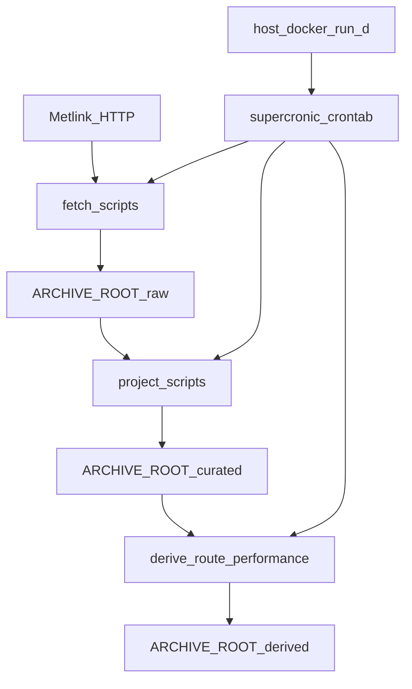

# Metlake — Implementation Plan

> **For agentic workers:** Use `superpowers:executing-plans` or `superpowers:subagent-driven-development`. Track steps with checkboxes in the canonical plan copy at [`docs/plans/2026-08-12-metlake.md`](docs/plans/2026-08-12-metlake.md) (written on first commit after `git init`).

**Goal:** Ship **metlake**, a self-contained archive appliance that captures Metlink GTFS / GTFS-RT / performance data into an immutable filesystem tree, projects it to Parquet with DuckDB, and runs on a schedule inside Docker **without privileged systemd/cgroup mounts**.

**Architecture:** Capture is dumb HTTP → temp file → atomic rename into `ARCHIVE_ROOT/raw/`. Projection is DuckDB SQL invoked by thin, single-purpose shell scripts. The container’s main process is a **scheduling dispatcher** ([supercronic](https://github.com/aptible/supercronic)) reading a plain `crontab` that launches those scripts. No systemd in the image.

**Why not the cgroup/systemd flags?** Full systemd as PID 1 expects to manage Linux cgroups. In Docker that usually means host cgroup namespace, `SYS_ADMIN`, and mounting `/sys/fs/cgroup` (or `--privileged`). That complexity is for “real init,” not for “run these scripts on a cron.” A crontab runner needs none of that: ordinary `docker run -e … -v …` is enough.

**Naming:** Project, image, and config paths use **metlake**. Upstream data source remains Metlink.

**Tech stack:** POSIX `bash`, `curl`, `sha256sum`, DuckDB CLI, Docker, supercronic + crontab. No Python/Pandas unless DuckDB cannot read a feed.

**Scope (locked):** Full brief — all three GTFS-RT feeds, full static GTFS zip, daily performance CSV snapshots, curated hourly/daily/monthly projections, and a thin regenerable route-performance derive join.

## Global constraints

- Secrets never enter git, Docker image layers, or `ARCHIVE_ROOT` — inject via runtime `-e` / `--env-file`.
- API key for local testing via `METLINK_API_KEY` env only; rotate after work if exposed in chat.
- Rate limit: max 10 req/s, burst 20; GTFS-RT fetch spaces the three endpoints (~200ms).
- Prefer shell + DuckDB SQL over custom processors.
- **One job = one script.** No umbrella CLI. Shared helpers in `lib/common.sh` only.
- All writes atomic (`*.tmp` → rename).
- Jobs exit non-zero on failure; never clobber a good curated file with a failed projection.
- Container runs **unprivileged** (no `--privileged`, no cgroup bind, no `SYS_ADMIN`).
- Open-source hygiene: LICENSE, README, CONTRIBUTING, CODE_OF_CONDUCT, `.env.example`, SECURITY.
- Product name is **metlake** everywhere user-facing.

## Locked design decisions

- **Static GTFS:** Capture `https://static.opendata.metlink.org.nz/v1/gtfs/full.zip` + `meta.json`. If same-day target exists, exit 0 and log skip (`FORCE=1` to replace).
- **GTFS-RT:** JSON for `tripupdates`, `vehiclepositions`, `servicealerts`. Filename from actual capture time (`HH-MM.json`).
- **Performance:** Daily snapshot of Metlink’s Bus performance Daily CSV.
- **Invocation model:** Separate readable scripts under `scripts/` installed to `/opt/metlake/scripts/`.
- **Parameters:** Env vars (`ARCHIVE_ROOT`, `METLINK_API_KEY`, `DATE`, `HOUR`, `MONTH`, `FEED`, `FORCE`). Scripts default previous hour/day/month when unset.
- **Scheduling:** **supercronic** as container `CMD`, driven by `/opt/metlake/crontab`. Not systemd. Not host cron.
- **Derived v1:** `derived/route-performance/YYYY-MM.parquet` — regenerable join only.
- **Language:** Linear bash + SQL files.

## Deployment model (scheduler as container process)

```text
Host
│
└── Docker (long-running, unprivileged)
    └── metlake image
        ├── process: supercronic /opt/metlake/crontab
        ├── crontab lines → /opt/metlake/scripts/*.sh
        ├── env: METLINK_API_KEY, ARCHIVE_ROOT=/archive
        └── /archive  (volume)
```

Primary run UX:

```bash
docker run -d \
  --name metlake \
  --env-file /path/to/metlake.env \
  -v /data/metlake:/archive \
  metlake:latest
```

No cgroup mounts. No `SYS_ADMIN`. No `--privileged`.

`Dockerfile` roughly:

- Base: Debian slim (or similar)
- Install curl, bash, ca-certificates, DuckDB CLI, supercronic
- `COPY` scripts/sql/crontab to `/opt/metlake/`
- `ENV ARCHIVE_ROOT=/archive`
- `CMD ["supercronic", "-passthrough-logs", "/opt/metlake/crontab"]`

Optional tiny entrypoint that validates `ARCHIVE_ROOT` is writable and `METLINK_API_KEY` is set, then `exec supercronic …`. Keep entrypoint boring (no job branching).

## Archive layout

```text
$ARCHIVE_ROOT/
  raw/
    gtfs/YYYY/MM/DD/full.zip
    gtfs/YYYY/MM/DD/meta.json
    gtfs-rt/{tripupdates,vehiclepositions,servicealerts}/YYYY/MM/DD/HH-MM.json
    performance/YYYY/MM/DD.csv
  curated/
    gtfs/YYYY-MM-DD/
    gtfs-rt/{feed}/hourly/YYYY/MM/DD/HH.parquet
    gtfs-rt/{feed}/daily/YYYY/MM/DD.parquet
    gtfs-rt/{feed}/monthly/YYYY/MM.parquet
    performance/daily/YYYY-MM-DD.parquet
    performance/monthly/YYYY-MM.parquet
  derived/
    route-performance/YYYY-MM.parquet
  metadata/
```

Default volume: host `/data/metlake` → container `/archive`.

## Repository layout (to create)

```text
.
├── README.md
├── LICENSE
├── CONTRIBUTING.md
├── CODE_OF_CONDUCT.md
├── SECURITY.md
├── .gitignore
├── .env.example
├── Dockerfile
├── docker-compose.yml
├── crontab                          # human-readable schedule
├── docs/
│   ├── brief.md
│   ├── plans/2026-08-12-metlake.md
│   ├── specs/2026-08-12-metlake-design.md
│   └── sources.md
├── lib/common.sh
├── scripts/
│   ├── check.sh
│   ├── status.sh
│   ├── fetch-gtfs.sh
│   ├── fetch-gtfs-rt.sh
│   ├── fetch-performance.sh
│   ├── project-gtfs.sh
│   ├── project-gtfs-rt-hour.sh
│   ├── project-gtfs-rt-day.sh
│   ├── project-gtfs-rt-month.sh
│   ├── project-performance-day.sh
│   ├── project-performance-month.sh
│   └── derive-route-performance.sh
├── sql/
└── tests/
```

No `systemd/` directory.

## Script surface (one job each)

```text
scripts/fetch-gtfs.sh
scripts/fetch-gtfs-rt.sh
scripts/fetch-performance.sh
scripts/project-gtfs.sh
scripts/project-gtfs-rt-hour.sh
scripts/project-gtfs-rt-day.sh
scripts/project-gtfs-rt-month.sh
scripts/project-performance-day.sh
scripts/project-performance-month.sh
scripts/derive-route-performance.sh
scripts/check.sh
scripts/status.sh
```

Manual:

```bash
ARCHIVE_ROOT=/data/metlake METLINK_API_KEY=… ./scripts/fetch-gtfs-rt.sh
DATE=2026-08-11 ./scripts/project-gtfs-rt-day.sh
```

## Crontab (baked into image)

Readable schedule, one line per script (illustrative):

```cron
*/5 * * * * /opt/metlake/scripts/fetch-gtfs-rt.sh
5 1 * * *   /opt/metlake/scripts/fetch-gtfs.sh
15 1 * * *  /opt/metlake/scripts/fetch-performance.sh
10 * * * *  /opt/metlake/scripts/project-gtfs-rt-hour.sh
30 2 * * *  /opt/metlake/scripts/project-gtfs-rt-day.sh
40 2 * * *  /opt/metlake/scripts/project-gtfs.sh
50 2 * * *  /opt/metlake/scripts/project-performance-day.sh
20 3 1 * *  /opt/metlake/scripts/project-gtfs-rt-month.sh
30 3 1 * *  /opt/metlake/scripts/project-performance-month.sh
40 3 1 * *  /opt/metlake/scripts/derive-route-performance.sh
```

Logs go to container stdout/stderr via supercronic `-passthrough-logs` → `docker logs`.

## Data flow



## Atomic commit sequence (execution order)

1. **`chore: initialize git repository and open-source scaffolding`**
2. **`feat: add shared lib and utility scripts`** — `lib/common.sh`, `check.sh`, `status.sh`
3. **`feat: implement raw GTFS zip capture`** — `fetch-gtfs.sh`
4. **`feat: implement GTFS-RT JSON capture for three feeds`** — `fetch-gtfs-rt.sh`
5. **`feat: implement performance CSV daily snapshot capture`** — `fetch-performance.sh`
6. **`feat: add DuckDB projections for GTFS and performance`**
7. **`feat: add GTFS-RT hourly/daily/monthly Parquet projections`**
8. **`feat: add thin derive route-performance script`**
9. **`feat: add crontab schedule for archive jobs`**
10. **`feat: Docker image with supercronic scheduler`** — unprivileged run docs + compose
11. **`test: smoke tests with fixtures and live optional check`**
12. **`docs: complete README usage, archive layout, and query examples`**

## Failure / idempotency rules

- Fetch: failed HTTP → delete temp → exit 1; never create destination
- Project: write `*.parquet.tmp` → rename only on success
- Re-runs: idempotent replace of same logical output
- Logging: script stderr → supercronic → `docker logs`

## Secrets checklist

- `.gitignore`: `.env`, `archive/`, `*.pem`, `credentials*`
- README uses `$METLINK_API_KEY` / `--env-file` only
- Never store keys under `/archive`; image build must not `COPY` a real `.env`

## Verification before claiming done

- `./scripts/check.sh` with temp archive
- Live fetch scripts for RT + GTFS + performance
- Hour/day project scripts from captured raw
- `docker build` succeeds; `docker run` needs only env + volume (no cgroup flags)
- Container process is supercronic; crontab jobs are invokable manually inside the container
- Atomic semantic commits; key string absent from git
- No systemd units; no umbrella CLI dispatcher
